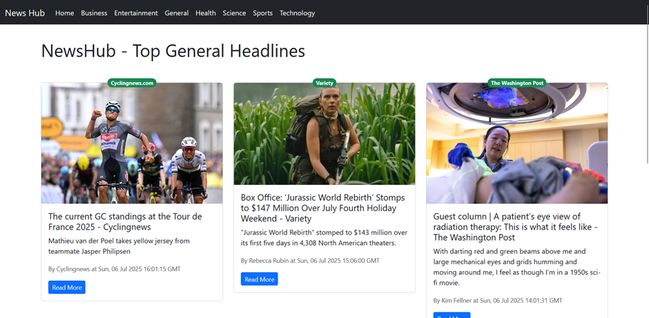

# 📰 NewsHub – React News App

A modern and responsive News App built with **React JS**, **Bootstrap**, and **NewsAPI.org**. Browse top headlines by categories like Business, Technology, Sports, Health, and more.

## 🚀 Features

- 🗂️ Category-based navigation (Business, Sports, Health, etc.)
- ⚡ Real-time news fetched using NewsAPI
- 📱 Responsive design with Bootstrap
- 🔄 Routing with React Router
- 🧭 Loading spinner on API fetch

## 🔧 Tech Stack

- React JS
- Bootstrap
- HTML5 & CSS3
- NewsAPI.org
- React Router

## 📦 Folder Structure
react-news-app/
├── public/
│   └── index.html
├── src/
│   ├── Components/
│   │   ├── NavBar.js
│   │   └── News.js
|   |   └── NewsItem.js
│   ├── App.js
│   ├── App.css
│   └── index.js
├── .env                  # contains API key 
├── .gitignore
├── package.json
├── README.md
├── LICENSE
└── docs/
    └── screenshot.png    

## 👨‍💻 Author

**Narender Dhariwal**

- 💼 Aspiring Full Stack Developer (Node.js + React)
- 🎓 Final Year Engineering Student
- 🔗 [LinkedIn](https://linkedin.com/in/narender-dhariwal=053a162259)
- 🧑‍💻 [GitHub](https://github.com/NarenderDhariwal10)
